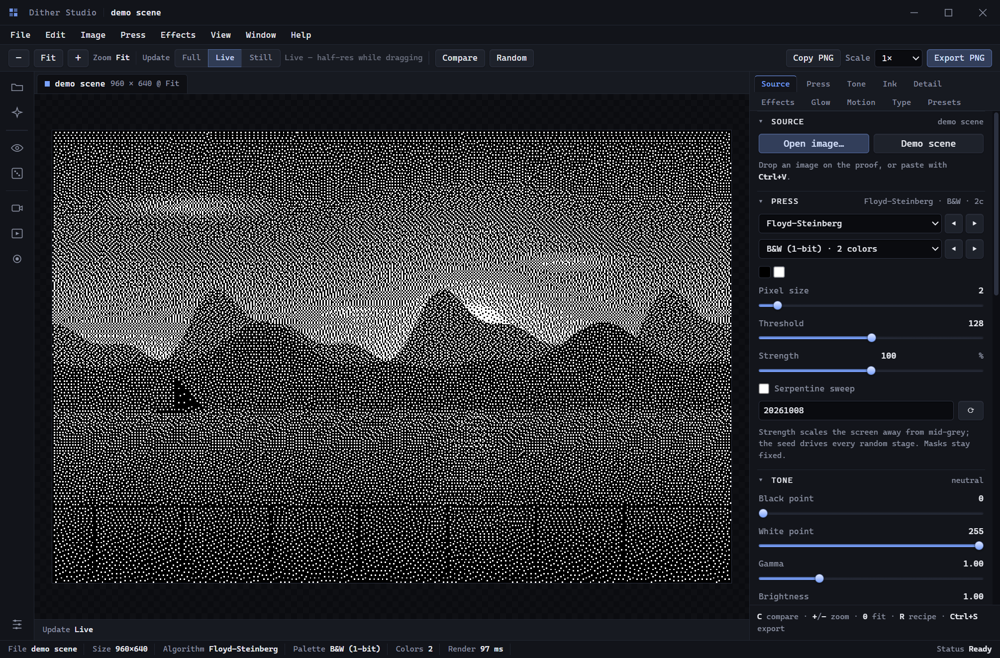
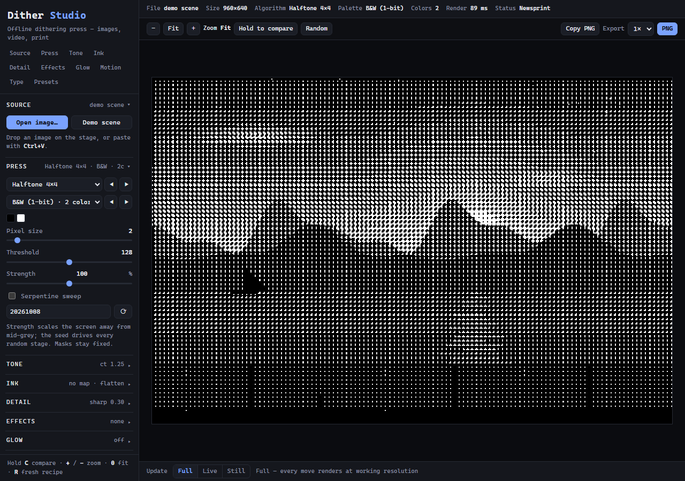
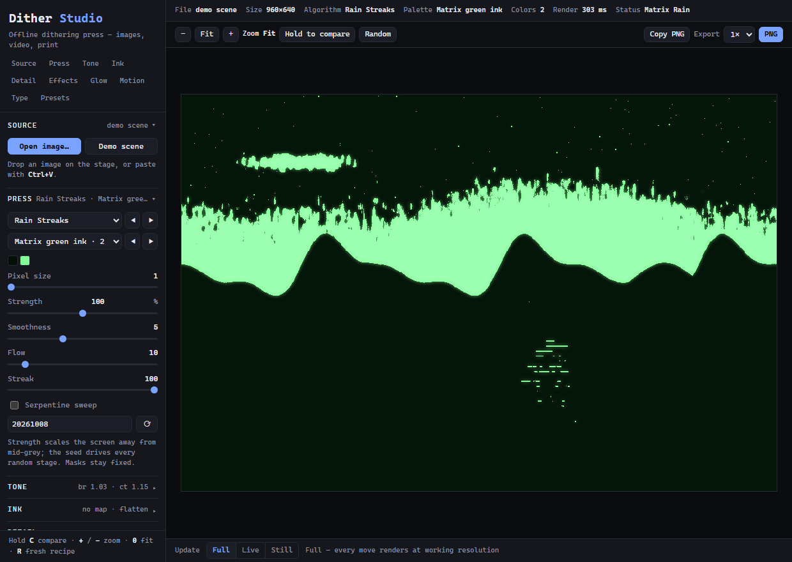
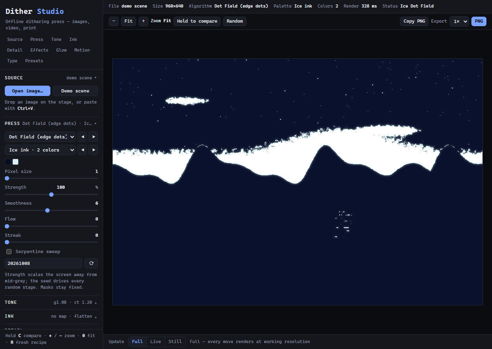

# Dither Studio

A print shop for pixels, in one folder. Load an image (or a video), pick an ink
set, choose a press, stack a few effects, and export the proof as a PNG — or the
video as WebM, or the proof as characters. Forty-six dither algorithms,
twenty-four palettes, twenty-one presets and thirteen effects, offline, with no
build step, no server and no packages.

It is a standalone app, not a website: double-click a launcher and it opens in
its own window with its own session, drop a file on it and it prints. The same
folder also opens as a page in any browser, and can be installed from the browser
as an app. Everything runs on your machine; nothing is uploaded anywhere.



## Three builds, one engine

This repository ships Dither Studio three ways. They share exactly one thing —
`dither.js`, the DOM-free engine — and differ everywhere else on purpose.

| Build | Where | State | How you get it |
|---|---|---|---|
| **Web demo** | `demo/` | frozen | <https://thijnperd.github.io/dither-studio/> — published from `demo/` by GitHub Pages |
| **Launcher app** | this folder | frozen | the launchers: the page in an app-mode window with its own profile |
| **Desktop app** | [`desktop/`](desktop/) | **active** | `Dither-Studio-Setup-<version>.exe` from [the latest release](https://github.com/thijnperd/dither-studio/releases/latest) |

The desktop build is the one being developed: an Electron application with a
caption bar it draws itself, menus holding the whole catalogue, the operating
system's own open and save dialogs, a tool rail, tabbed documents and a dock of
panels.

The two web builds are frozen: they are the versions people have links to.
`demo/` is a self-contained copy kept apart so the demo can be hosted on Pages
without the app the desktop build ships ever appearing on the public site.
The **engine** is what all three share: `dither.js` is copied into the desktop
build verbatim, and `node desktop/tools/sync-renderer.js --check`, which CI runs,
fails if that copy drifts. Everything else — the shells, the chrome — is each
build's own.



New here? **[GUIDE.md](GUIDE.md)** is the tour: running it as an app, the console
station by station, the three structure-aware looks, video mode, exports, keys,
performance and troubleshooting. The desktop window has its own tour in
**[desktop/GUIDE.md](desktop/GUIDE.md)**.

## Run it

| | |
|---|---|
| **Windows** | double-click **`Dither Studio.cmd`** |
| **macOS** | double-click **`Dither Studio.command`** (right-click → Open the first time, if Gatekeeper asks) |
| **Linux** | `./dither-studio.sh` (make it executable once: `chmod +x dither-studio.sh`) |
| **Any browser** | open **`index.html`** |
| **Installed app** | open `index.html`, then use the browser's *Install* / *Create shortcut* command — `manifest.webmanifest` makes it installable |
| **Desktop app** | [`desktop/`](desktop/) — or the installer from [the latest release](https://github.com/thijnperd/dither-studio/releases/latest) |

The launchers use Chrome, Edge, Brave or Chromium in app mode (`--app`), with a
profile of the app's own — under `%LOCALAPPDATA%\Dither Studio`,
`~/Library/Application Support/Dither Studio` or `~/.local/share/dither-studio`,
never inside this folder. Nothing is installed, nothing is registered, and
deleting that profile resets the app. If no Chromium-family browser is found, the
launcher opens `index.html` in your default browser instead. Set
`DITHER_DRY_RUN=1` to see the command it would run without running it.

Keep the folder together — the app is these files, and the launchers look for
`index.html` next to themselves.

## The desktop app

The press in its own window: a frameless Electron application with a caption
bar, a menu bar, an options bar, a tool rail, tabbed documents and a dock of
panels — Photoshop's shape, Dither Studio's palette. It opens images, clips and
webcams through the operating system's own dialogs, saves proofs to real files,
and ships as a Windows `.exe`.

**Download:** [the latest release](https://github.com/thijnperd/dither-studio/releases/latest)
— take `Dither-Studio-Setup-<version>.exe` to install it, or
`Dither-Studio-<version>-portable.exe` to run it from anywhere with no install.

### Run it from source

```bash
cd desktop
npm install          # electron + electron-builder, the only dependencies
npm start            # opens the app
```

Node 20 or newer. `npm install` pulls Electron (about 100 MB) once; after that
the app starts in a second or two.

### The window

```
┌───────────────────────────────────────────────────────────────────────────┐
│ ▣ Dither Studio  demo scene          Saved proof.png — click to reveal  — □ ×│  caption
│ File  Edit  Image  Press  Effects  View  Window  Help                     │  menu bar
│ − Fit +  Zoom Fit │ Update Full Live Still │ Compare Random │ … Export PNG│  options bar
├────┬────────────────────────────────────────────────┬─────────────────────┤
│    │ ▣ demo scene  960 × 640 @ Fit                  │ Source Press Tone … │  panel tabs
│ ▤  │                                                │                     │
│ ✦  │              the proof                         │  SOURCE             │  panels
│ ◉  │         (checkerboard well)                    │  Open image…        │
│ ⚄  │                                                │  PRESS              │
│    │                                                │  Floyd–Steinberg ▸  │
│    │                                                │  ●━━━━━ 100%        │
├────┴────────────────────────────────────────────────┴─────────────────────┤
│ Update Live                    ▶ Play  frame 0 · 12 fps                   │  viewport bar
│ File demo scene │ Size 960×640 │ Algorithm … │ Colors 4 │ Render 71 ms     │  status bar
└───────────────────────────────────────────────────────────────────────────┘
```

The caption bar is the window's own, and the note on its right is a receipt:
after a save it names the file, and clicking it opens the file's folder. Every
catalogue lives in the menus — all 46 algorithms, 24 palettes, 13 effects, 11
tone maps and 21 recipes, expanded from the app's own tables, so a new algorithm
can never be missing from a menu. The dock holds the ten panels as tabs; the
status bar carries the file, its size, the press, the colours and the last render
time. [desktop/GUIDE.md](desktop/GUIDE.md) walks the window and the menus menu by
menu.

### Keyboard

| | |
|---|---|
| `Ctrl+O` / `Ctrl+Shift+O` | open an image / open a clip |
| `Ctrl+S` | save the proof as a PNG (native save dialog) |
| `Ctrl+Shift+C` | copy the proof to the clipboard |
| `Ctrl+D` | generated demo scene |
| `Ctrl+R` / `Ctrl+Shift+R` | roll a fresh recipe / new seed |
| `Ctrl+↑` `Ctrl+↓` | previous / next algorithm |
| `Ctrl+←` `Ctrl+→` | previous / next palette |
| `Ctrl+T` | print with characters |
| `Ctrl+=` `Ctrl+-` `Ctrl+0` | zoom in / out / fit in window |
| `F5` `F11` `F1` | reload the window, full screen, the guide |
| `Ctrl+Shift+I` | developer tools |
| `C` (hold) | compare with the source — the rail tool does the same |
| `+` `−` `0` `R` | zoom, fit, a fresh recipe |

A file dropped on the proof loads it; `Ctrl+V` pastes an image.

### What is genuinely native

- **Open and save dialogs** are the operating system's, with filters for the
  formats the app actually writes. A save returns a path, and the caption bar
  shows it.
- **Files arrive as bytes, not as paths.** The main process reads the file and
  hands the renderer an `ArrayBuffer`; a `file://` image in a `file://` page is
  an opaque origin to Chromium, which would taint the canvas and kill
  `getImageData` — the whole engine.
- **The clipboard** is Electron's, so a copied proof is a real PNG on the system
  clipboard, ready to paste into anything.
- **One window per app**: a second launch focuses the running one, and image
  files can be opened *with* Dither Studio (`Ctrl+O` is not the only way in).
- **The application menu** is a real Electron menu, which is what gives macOS a
  menu bar. On Windows and Linux the window is frameless and draws its own menu
  bar, so the chrome binds those accelerators itself.

### How it is put together

| File | |
|---|---|
| `electron/main.js` | the window, the splash, the native dialogs, the clipboard, the application menu, and the smoke harness |
| `electron/preload.js` | the only bridge to the OS — `window.ditherDesktop`, context-isolated, no Node in the renderer |
| `electron/splash.html` | the startup animation: **this is the file to replace** (see below) |
| `electron/Splash/` | the source PNGs the animation was built from (Adam, Adam dithered, God). The document inlines its own copies, so `build.files` keeps this folder out of the package |
| `src/index.html` | the window's markup: caption, menus, options, rail, document tabs, dock, status |
| `src/menu-spec.js` | the one menu definition, shared by the native menu and the drawn one |
| `src/renderer/core.js` | **the desktop core**: the colour pair, the catalogue lookups, the settings paths, the one dropdown builder |
| `src/renderer/dither.js` | the engine — DOM-free, byte-identical to the web builds |
| `src/renderer/video.js` | the video source, clock and recorder |
| `src/renderer/app.js` | the desktop shell: rendering, controls, the native routes, and the command surface the menus drive |
| `src/renderer/shell.js` | the chrome: menus, tool rail, caption, slider fills, window verbs |
| `src/styles/tokens.css` | tokens, the page grid, every element-level control |
| `src/styles/chrome.css` | caption, menus, options bar, rail, document tabs, the well, the bars |
| `src/styles/panels.css` | the dock: panel tabs, fields, sliders, swatches, the effects stack |
| `tools/sync-renderer.js` | regenerates `src/renderer/app.js` from the shared core |
| `tools/smoke-in-page.js` | the page half of the smoke run |

The desktop shell is the desktop's own. It used to be the web shell with ten
patches applied, which meant every console helper existed twice — once in the
shared shell and once in the copy that actually runs — so the desktop now has a
**core of its own**: `src/renderer/core.js`, the one place the colour pair, the
catalogue lookups, the settings paths and the five dropdowns live. The web builds
keep their shell; what every build shares is the engine.

```bash
node tools/sync-renderer.js          # refresh the engine copies
node tools/sync-renderer.js --check  # fail if either has drifted (CI runs this)
node tools/core.test.js              # the core's own rules, in Node
```

### Build the installer

```bash
cd desktop
npm run dist     # dist/Dither-Studio-Setup-<version>.exe + the portable exe
npm run pack     # dist/win-unpacked/ only, much faster while iterating
```

electron-builder writes an NSIS installer (per-user, choose the folder, Start
menu shortcut) and a portable single-file executable. The icon comes from
`build/icon.png`, the app's own dithered mark; keep it in step with
`icons/icon-512.png` in the repository root, which is the same 512 px proof.

### The startup screen

Adam's arm reaches in from the left, God's from the right. When the two
fingertips touch, Adam is dithered — his own pre-screened image is revealed over
the painted one, spreading from the fingertip back along the arm — and starts to
glow; God stays painted, so the moment reads as the press taking a hand. The
wordmark inks in underneath and the window opens.

`electron/splash.html` is one self-contained document (inline style, inline
script, every image inlined as a data URI, nothing fetched from disk) and it is
meant to be replaced. Its header names the three parts to change: `HANDS`, the
three images and the fingertip inside each one; `T`, the whole schedule in
milliseconds; and the ink colour. The frames only blit — the three images decode
once, the light dots of the dithered one are recoloured to the ink once, the glow
is a single blurred copy built when the box is laid out, and every frame after
that only draws them. A splash that re-screened the hand sixty times a second
would be the one thing in this project that pegged a core. If you change the
total, change `SPLASH_MIN_MS` in `electron/main.js` (2900 ms) to match.

To look at a single frame while you work on it, hold the animation and shoot it:

```bash
DITHER_SPLASH_MS=99999 DITHER_SPLASH_AT=2400 npm run smoke
# -> $DITHER_SMOKE_DIR/dither-splash.png, frozen at 2.4 s
```

### Performance

The desktop build inherits the engine's budget unchanged: the working image is
capped at 1600 px on its longest side, dragging a slider renders a half-res
preview on the next frame, and the full pass runs when the control is released.
The chrome adds nothing per frame — the only timer in the app polls a recording
flag twice a second. On a 1024² frame the heaviest algorithm stays in the low
seconds, which is the same number the web build reports.

## What it does

- **46 algorithms** — classic ordered screens, void-and-cluster and blue noise,
  stochastic dithers, Yliluoma colour mixing, fourteen error-diffusion kernels,
  and three **structure-aware** screens that read the image's own contours
  instead of tiling over it.
- **24 palettes** — 1-bit B&W, Game Boy, C64, NES, ZX Spectrum, CGA, Teletext,
  Apple II, MSX, Virtual Boy, PICO-8, EGA, Macintosh II, Gruvbox, four grey
  ramps and six single-ink sets (amber, sepia, cyan, blueprint, matrix green,
  ice). Colour modes snap every pixel to the palette, and every output pixel is
  exactly one of its inks.
- **Phone and iPad** — the same console, contracted rather than redesigned: a
  finger-sized layout, pinch-to-zoom on the proof, and a rail that collapses
  into one console bar with a live summary of the station in view.
- **Tone, detail, ink** — black/white point, gamma, brightness, contrast,
  saturation, hue; blur, unsharp mask, median denoise; eleven tone maps that
  re-ink the finished dither so 1-bit stays exactly two inks, including your own
  ink and paper.
- **Thirteen effects in a stack** — chromatic aberration, JPEG blocks, scanlines,
  grain, pixel sort, wave, drip, kaleidoscope, dead pixels, vignette, CRT bloom,
  ripple, starfield — added one at a time, reorderable, each with its own amount
  and mode. Plus a blurred **glow** pass in linear light.
- **Chunky pixels** — a pixel size of 1–16 box-averages the image before
  dithering and upscales it without smoothing, for pixel-art output.
- **Text mode** — print the proof as ASCII, blocks, shades, hex or binary, and
  export the grid as `.txt`.
- **Video** — a video file or the webcam through the whole press, 1–30 fps, three
  temporal dither rules, and WebM recording. A frame that overruns its slot is
  dropped rather than queued.
- **Exports** — PNG at 1×, 2×, 4× or 8× with nearest-neighbour scaling, copy to
  clipboard, the text grid, and the current recipe as JSON.

### The three structure-aware looks

Three screens built for photographs, all in the box as presets. They stretch a
noise field along the image's own iso-luma contours (a short line-integral
convolution along the gradient's tangent), then bias it towards edges, so the
screen follows shading instead of fighting it.

| Preset | Screen | Character |
|---|---|---|
| **Matrix Rain** | Rain Streaks | Stretches the screen vertically: midtones print as dot strings that run down the frame. |
| **Ice Dot Field** | Dot Field | Flats collapse toward a plain threshold while edges open up, so a subject prints as dots on clean paper. |
| *Smooth Diffusion* | Smooth Diffusion | A calm, wavy screen — the darkest and busiest of the three over a photo. |




Three sliders push them around — **Smoothness** (feature size), **Flow** (how far
the screen stretches along contours) and **Streak** (how far it runs vertically)
— and both reaches are bounded by a sample budget, so a large working image
cannot make the screen loop unbounded.

## Exports

| What | How |
|---|---|
| PNG | **Export** at 1×, 2×, 4× or 8× the working resolution, nearest-neighbour, so the pixel grid stays crisp |
| Clipboard | **Copy PNG** puts the current proof on the clipboard |
| Text | **Text mode** on, then **Export .txt** |
| WebM | **Record** in video mode (auto-stops at 60 s) |
| Recipe | **Presets → Export JSON** writes the current settings; importing merges them over the defaults |

## Requirements

A modern browser (Chrome, Edge, Brave, Firefox or Safari). A Chromium-family
browser is only needed for the app-window launchers. Nothing else: no Node, no
Python, no package manager — Node is needed only to run the tests or regenerate
the icons. The desktop build adds Node 20+ and its two dev dependencies.

## Repository layout

| Path | What it is |
|---|---|
| `dither.js` | the engine: screens and masks, 46 algorithms, palettes, mixing plans, adjustments, tone maps, alpha, effects, glow, video temporal rules, `process()`. DOM-free, shared by all three builds |
| `index.html`, `style.css`, `app.js`, `video.js` | the launcher/web shell: markup, the console stylesheet, canvas rendering and controls, and video mode |
| `Dither Studio.cmd`, `Dither Studio.command`, `dither-studio.sh` | the app-mode launchers |
| `manifest.webmanifest`, `icons/` | installable-app metadata and the generated mark |
| `tools/make-icons.js` | regenerates `icons/` through the app's own core |
| `test.js` | the engine's Node tests |
| `tools/` | optional browser-check harness (`check.sh`, `browser-check.cjs`); Playwright is a global tool, never a dependency |
| `demo/` | the **frozen** web demo published to GitHub Pages |
| `desktop/` | the **active** Electron build, in its own folder with its own dependencies |
| `docs/` | the screenshots in this file and the guides |
| `.github/workflows/` | `test.yml` runs the engine tests and the renderer-sync check; `pages.yml` publishes `demo/` |
| `README.md` | this file — the front door for the whole repository |
| `GUIDE.md` | the tour: the console, the catalogue, video, exports, troubleshooting |
| `desktop/GUIDE.md` | the tour of the desktop window |
| `SOURCES.md` | where every feature, table and palette came from |

## Verification

Three layers of checks ship with the app.

### The engine, in Node

```bash
node test.js
```

The tests use Node's built-in `assert`; nothing needs installing. They cover
matrix generation and endpoint safety, void-and-cluster determinism, blue-noise
bounds, palette lookup, tone reproduction on flat patches, palette membership of
every output pixel, seeded determinism across all 46 algorithms, the
structure-aware screens, pixel chunking, settings clamping, the adjustments,
every effect and its modes, glow, tone maps, the three alpha modes, the video
temporal rules, and the performance budget — and they print the timings for the
1024×1024 pixel-size-1 budget, so a regression is visible even when the generous
cap still passes. CI runs the same command on Node 20 and 22.

### The page, in a real browser

`tools/` holds a small headless driver that loads a page, records console and page
errors, can press keys, click, assert selectors exist, evaluate JS and
screenshot. It prints a JSON summary and exits non-zero on any error or missing
`--expect`.

```bash
bash tools/check.sh index.html --expect canvas --screenshot /tmp/dither.png
```

| Option | Meaning |
|---|---|
| `--wait <ms>` | wait after load before checking (default `1000`) |
| `--size <WxH>` | viewport size (default `1000x700`) |
| `--expect <sel>` | fail unless the selector exists (repeatable) |
| `--press <key>` | press a key after load, e.g. `c`, `0`, `r` (repeatable) |
| `--click <sel>` | click an element after load (repeatable) |
| `--screenshot <file>` | save a PNG of the final state |
| `--eval <js>` | evaluate JS in the page and print the result |
| `--headed` | show a real window (default: headless) |

A local path is turned into a `file://` URL automatically. `check.sh` is a wrapper
that points `NODE_PATH` at the global npm root; `browser-check.cjs` also falls
back to `npm root -g` itself, so the wrapper is a convenience, not a requirement.
It needs Playwright installed **globally**, so the app stays dependency-free:

```bash
npm install -g playwright
playwright install chromium
```

The page exposes `window.__dither`, so a check can set a recipe, run a preset or
step through video frames without clicking anything:

```bash
# what the app currently reports
bash tools/check.sh index.html --eval "JSON.stringify(window.__dither.stats())"

# a preset, then the inks actually drawn on the canvas
bash tools/check.sh index.html --eval \
  "window.__dither.applyPreset('matrixrain'); window.__dither.canvasColors()"

# the console: station state, the effects stack, the update mode
bash tools/check.sh index.html --eval "(function(){ var d = window.__dither; \
  d.addEffect('scanlines'); d.addEffect('grain'); d.moveEffect(1, -1); \
  return { stack: d.activeEffects(), quality: d.setQuality('still'), \
           groups: d.groups().length, swatches: d.swatches().length }; })()"

# video, with no file and no camera: the generated clip drives real frames
bash tools/check.sh index.html --eval \
  "JSON.stringify(window.__dither.videoSynthetic(480, 320))"
```

Run from the repository root so `index.html` resolves, and note that the harness
takes only the last `--eval` — chain multi-step checks inside one (async)
expression. `ok` is `true` only when there are no console errors, no page errors
and every `--expect` matched. [GUIDE.md](GUIDE.md) describes what the app should
do when you drive it, and lists every hook.

### The desktop app

```bash
cd desktop
npm test                                       # the core's rules: 21 checks, no window
npm run smoke                                  # boot, check, screenshot, exit 0/1
```

`npm test` is `node tools/core.test.js`: the colour round trip, the catalogue
lookups the steppers and the menus share, the settings paths, the station notes
and the dropdown builder — all of it DOM-free, so it runs in a plain Node job
rather than behind a window.

`npm run smoke` is `electron . --smoke --smoke-script tools/smoke-in-page.js`.
`--smoke` loads the real app and waits for it to signal ready, `--smoke-script`
evaluates that file in the page, then the harness prints one JSON report and
exits non-zero on any console error, page error, failed check or failed command
— the page's own verdict is part of the run's, not a footnote beside it. It also
photographs both windows into `$DITHER_SMOKE_DIR`: the splash window shoots
itself as its animation reaches the wordmark (it is over in under three seconds,
so waiting for the page checks to finish would miss it), and the app window is
shot at the end.

The current run makes 34 checks: the chrome exists, the catalogues fill their
lists, every slider is painted, the menus draw, their submenus expand to the full
catalogue and stay open while the pointer is on one of their rows, all 32 command
names are wired, the effects stack is the real markup, panels answer to their own
verbs, and **a key press runs exactly one command**.

Environment variables let it exercise the parts a page cannot reach:

| Variable | What it does |
|---|---|
| `DITHER_SMOKE_DIR` | where the screenshots go (default: the temp directory) |
| `DITHER_SMOKE_SAVE=<path>` | answer every save dialog with this path — how the export chain is proved end to end |
| `DITHER_SMOKE_OPEN=<path>` | answer every open dialog with this file |
| `DITHER_SMOKE_MENU='File/Save Proof as PNG'` | click that native menu item, then report whether a file landed |
| `DITHER_SMOKE_KEY=ctrl+s` | send that key through the window's input pipeline (`DITHER_SMOKE_KEY_BEFORE=1` to press before the page script) |
| `DITHER_SMOKE_REPORT=<path>` | also write the JSON report to a file — the only way to read the verdict of a packaged `.exe`, which has no console |
| `DITHER_SPLASH_MS=<ms>` | keep the splash up this long, to photograph it |
| `DITHER_SPLASH_AT=<ms>` | hold the splash animation on that one frame — how each stage was checked and how `docs/desktop-splash.png` was taken |
| `DITHER_NO_SPLASH=1` | skip the splash entirely |

```bash
# the whole export chain: a simulated Ctrl+S, then proof the file exists
DITHER_SMOKE_SAVE=/tmp/proof.png DITHER_SMOKE_KEY=ctrl+s npm run smoke

# the native menu drives the app
DITHER_SMOKE_SAVE=/tmp/menu.png DITHER_SMOKE_MENU='File/Save Proof as PNG' npm run smoke
```

The same harness runs against a packaged build, which is the only way to check
what actually shipped. Give the script an absolute path there: a portable
executable unpacks into its own temporary folder and runs with that as its
working directory.

```bash
DITHER_SMOKE_REPORT=/tmp/report.json DITHER_SMOKE_SAVE=/tmp/proof.png \
  DITHER_SMOKE_KEY=ctrl+s ./dist/Dither-Studio-<version>-portable.exe --smoke \
  --smoke-script "$PWD/tools/smoke-in-page.js"
```

## Credits

Inspired by **Dither Boy** (Studio AAA, commercial) and by
[**dither-guy**](https://github.com/manoelpiovesan/dither-guy), an open-source
Python alternative whose pipeline shape (adjust → downscale → dither →
post-process) informed this one. The structure-aware screens are built on the
idea of structure-aware halftoning and Cabral & Leedom's line-integral
convolution; the temporal rules are the classic temporal-dither choices made
explicit. No code was copied from any of these projects: the algorithms are the
published classics, the palettes are hardware facts, and this implementation is
original JavaScript. See [`SOURCES.md`](SOURCES.md) for the provenance of every
feature and constant. Not affiliated with any project named here.
